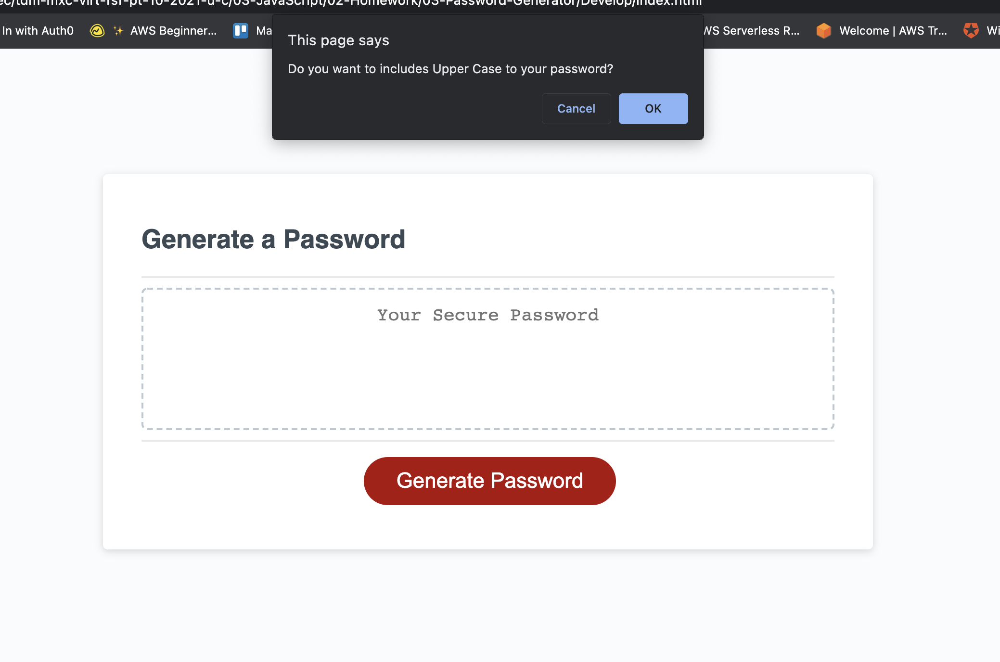
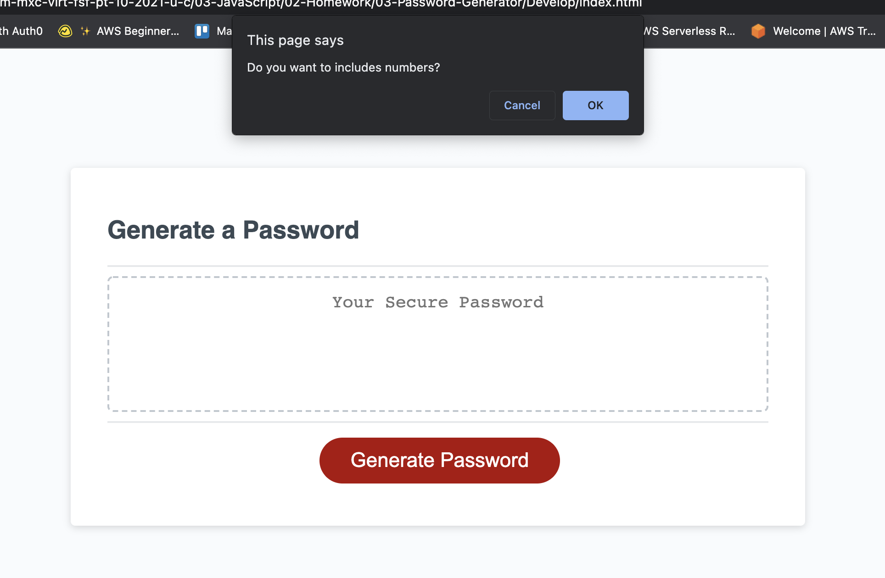
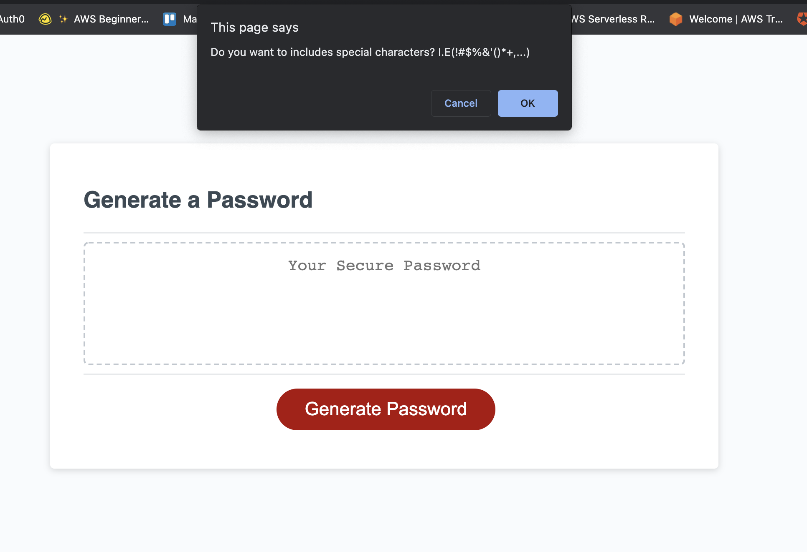
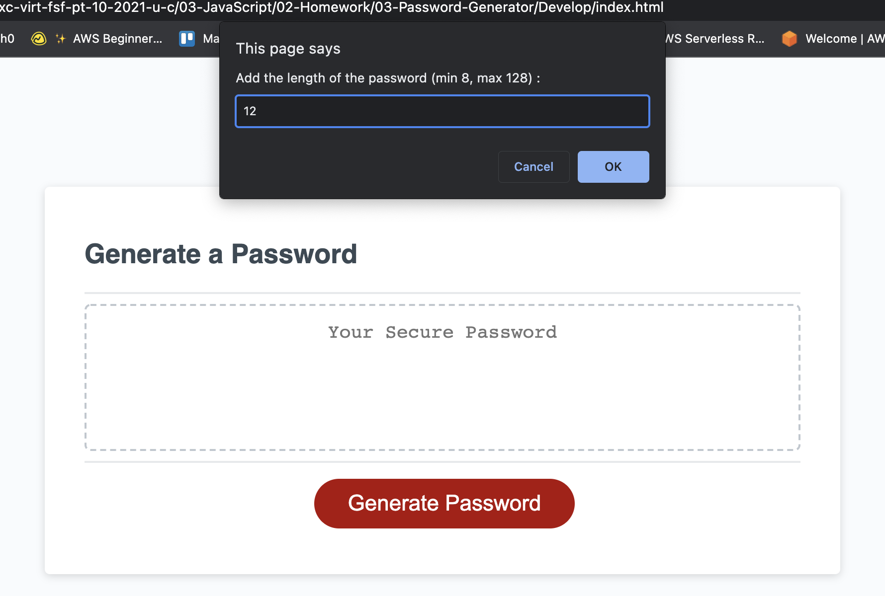
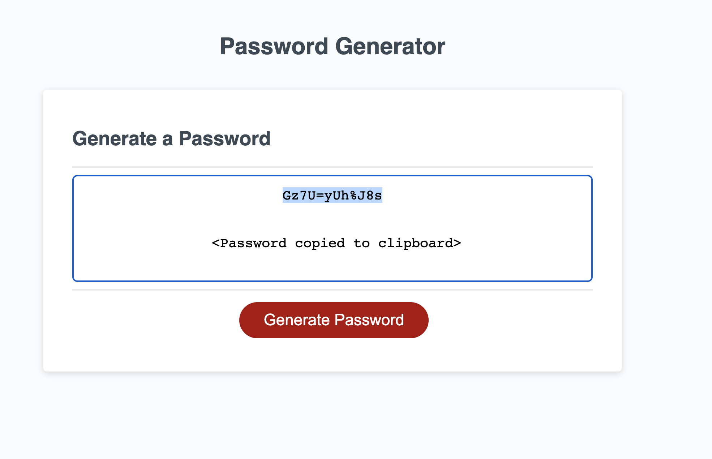

# 03-Password-Generator

In this application we are going to create a Password Generator using JS, HTML and CSS.

## User Story

```
AS AN employee with access to sensitive data
I WANT to randomly generate a password that meets certain criteria
SO THAT I can create a strong password that provides greater security
```

## Acceptance Criteria

```
WHEN I click the button to generate a password
THEN I select which criteria to include in the password
WHEN asked for character types to include in the password
THEN I confirm whether or not to include uppercase, numeric, special characters,  and the length of the password
WHEN I answer each prompt
THEN my input should be validated and at least one character type should be selected
WHEN all prompts are answered
THEN a password is generated that matches the selected criteria
WHEN the password is generated between 8 to 128 length
THEN the password is displayed written and selected to the page and copy to the clipboard.
```

## Mock-Up

The following image shows the web application's appearance and functionality:






